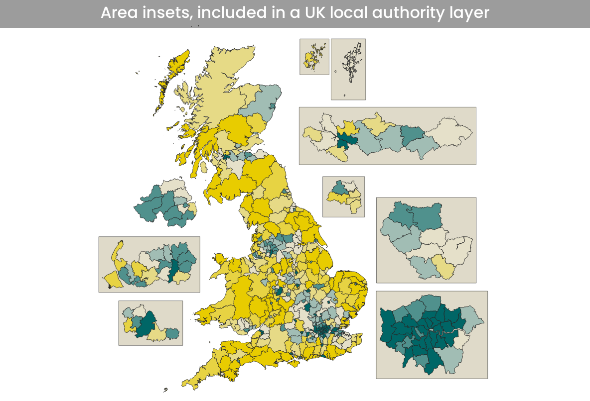

# A UK local authority file (from May 2020) with area insets
This is a very beta version of a UK local authority layer that includes larger insets for 7 parts of the UK. I haven't included everywhere (sorry), just soem of the main urban areas with small areas that are difficult to see on a zoomed out map.

Feel free to use as you see fit.

**There are three zipped folders. One is just the boxes that the insets fit within. The other two are the UK local authority files - one version has just the basic fields (area names, codes, country, etc) but I also added another one with population data, using the latest ONS mid-year estimates (2019). The 'scale' field tells you how much bigger I made the inset areas - everywhere is 3x bigger, apart from London (5x) and Orkney and Shetland (same size, just moved south).**

I have also included bounding boxes with a 10km buffer so that you can add these in to make clear which areas are insets and which are not.

The idea behind this is to make maps that are easier to see and understand, but also more quickly, and from one layer. 

There are lots of possibiliites, but if you wanted to just put Orkney and Shetland into a little inset, you could run a flter on the layer, something like this:

*"inset_area" = 'None' and NOT "lad20nm" IN ('Orkney Islands','Shetland Islands') OR "inset_area" = 'Orkney and Shetland'*

If you just wanted an inset for London, you could try something like this:

*"inset_area"  IN ('Greater London','None')*

If you wanted to show all insets, but not Shetland and Orkney in their actual location, then you could do this:

*NOT "areaname" IN( 'Orkney Islands','Shetland Islands') OR "inset" = 'Yes'*

And in all cases you just do a similar filter on the box layer to show a box round these areas.

I used data from the ONS geography portal to create this. It's all open, licenced under the Open Government Licence v3.0. 

Source: Office for National Statistics licensed under the Open Government Licence v.3.0. Contains OS data © Crown copyright and database right [2020].

**Alasdair Rae**
26 Nov 2020

(work in progress)

